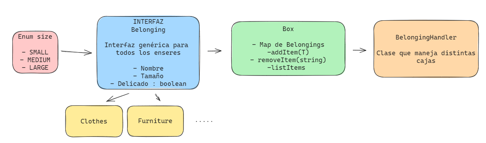

[](https://coveralls.io/github/ULL-ESIT-INF-DSI-2324/ull-esit-inf-dsi-23-24-prct06-generics-solid-OscarCordobesNavarro?branch=oscarcn)

## Introducción

En esta práctica, nos adentraremos un poco más en profundidad en las interfaces y clases genéricas, junto a los principios SOLID.

Es fundamental recordar que, antes de comenzar con los ejercicios, debemos configurar un entorno de trabajo adecuado. Puedes encontrar información detallada sobre cómo hacerlo [aquí](https://ull-esit-inf-dsi-2324.github.io/ull-esit-inf-dsi-23-24-prct02-vscode-OscarCordobesNavarro/)

Además, incorporaremos pruebas unitarias con Mocha y Chai, así como la generación automática de documentación. Para obtener más detalles y aprender a configurar tanto TypeDoc como Mocha y Chai, puedes consultar [este link](https://ull-esit-inf-dsi-2324.github.io/ull-esit-inf-dsi-23-24-prct03-types-functions-OscarCordobesNavarro/#instalación-de-typedoc-y-configuración-del-mismo)

Por último, también estaremos utilizando Istanbul y Coveralls para el cubrimiento de código. Si desea saber cómo instalarlo y configurarlo, puede consultar [esta información](https://ull-esit-inf-dsi-2324.github.io/ull-esit-inf-dsi-23-24-prct05-objects-classes-interfaces-OscarCordobesNavarro/#md:configuraci%C3%B3n-y-uso-de-istanbul-y-coverall)


## Resolución de ejercicios

### Ejercicio 1 - La mudanza

La idea es crear un tipo de gestor para una mudanza, donde tendremos enseres que serán almacenados en cajas. Posteriormente, estas cajas serán gestionadas por el servicio de mudanza en sí. El sistema se estructurará de la siguiente manera:



Un ejemplo de un objeto que implementa la interfaz `Belonging` es la que hace referencia a la ropa
```typescript
export class Clothes implements Belonging {
    name: string;
    delicate: boolean;
    size: size = size.SMALL;

    constructor(name: string, delicate: boolean, size?: size) {
        this.name = name;
        this.delicate = delicate;
        if (size) {
            this.size = size;
        }
    }

    getName(): string {
        return this.name;
    }

    getDelicate(): boolean {
        return this.delicate;
    }

    getSize(): size {
        return this.size;
    }
}
```

Las cajas a su vez solo podrán tener enseres que contengan la interfaz `Belonging`, para ello se le hace una restricción al parámetro de tipo para que sea una implementación de la interfaz `Belonging`, a parte viene acompañado con algunos métodos:

```typescript
export class Box<T extends Belonging> {

    private items: Map<string, T> = new Map<string, T>();
    private id: string;

    constructor(id: string) {
        this.id = id;
    }

    addItem(item: T): void {
        this.items.set(item.getName(), item);
    }

    removeItem(item: string): void {
        this.items.delete(item);
    }

    getName(): string {
        return this.id;
    }

    private getItems(): Iterator<T> {
        return this.items.values();
    }

    findItem(item: string): T {
        return this.items.get(item)!;
    }

    listItems(): void {
        const iterator = this.getItems();
        let result = iterator.next();
        let items: string = "";
        while (!result.done) {
            items += result.value.getName() + ", ";
            result = iterator.next();
        }
        console.log("Id: " + this.id + "( Items: " +this.items.size + ")" + " contains: " + items);
    }
}
```

Y ahora para manejar las cajas necesitamos a alguna clase para poder interactuar con la colección, de esto se encarga la clase `MovingHandler`. En este caso lo implementado tambien con un parámetro de tipo genérico para hacerlo mas escalable.

```typescript
export class MovingHandler<T extends Belonging> {
    private boxes: Map<string, Box<T>>;

    constructor() {
        this.boxes = new Map<string, Box<T>>();
    }

    public addBox(box: Box<T>): void {
        this.boxes.set(box.getName(), box);
    }

    public removeBox(box: string): void {
        this.boxes.delete(box);
    }

    private getBoxes(): Iterator<Box<T>> {
        return this.boxes.values();
    }

    public findBox(box: string): Box<T> {
        return this.boxes.get(box)!;
    }

    public listBoxes(): void {
        console.log("Boxes: ");
        const iterator = this.getBoxes();
        let result = iterator.next();
        while (!result.done) {
            result.value.listItems();
            result = iterator.next();
        }
    }
}
```

### Ejercicio 2 - Facturas en diferentes formatos

En este ejercicio, la idea es desarrollar un sistema que permita exportar las facturas a diversos formatos, inicialmente en PDF y HTML, aunque podría admitir otros formatos. Por esta razón, representamos la factura como una clase de la siguiente manera:

```typescript
export class Bill {
    constructor(private id: number, private date: Date, private amount: number, private client: string, private paid: boolean = false) {}

    getId(): number {
        return this.id;
    }

    getDate(): string {
        const day = this.date.getDate();
        const month = this.date.getMonth() + 1;
        const year = this.date.getFullYear();
        return `${day}/${month}/${year}`;
    }

    getAmount(): number {
        return this.amount;
    }

    getPaid(): boolean {
        return this.paid;
    }

    getClient(): string {
        return this.client;
    }
}
```

Depués de esto definimos la interfaz que van a tener las maneras de exportar:

```typescript
/**
 * Interfaz que representa una factura exportable.
 */
export interface ExportBill {
    extention: string;

    exportBill(bill: Bill): void;
}
```

En este caso se ha implementado la forma de exportar en HTML y en PDF, es en el caso de PDF he utilizado la librería `pdfkit` para poder gener un pdf a partir de la factura dando como resultado la clase `ExportPDF`:

```typescript
export class ExportPDF implements ExportBill {
  public extention: string = "pdf";

  exportBill(bill: Bill): void {
    console.log(`Exportando factura ${bill.getId()} a PDF`);
    console.log(this.generatePDF(bill));
  }

  private generatePDF(bill: Bill) {
    const doc = new PDFDocument({ size: "A4" });
    const output = fs.createWriteStream("./exports/bill.pdf");

    // Si no existe el directorio, lo creamos
    if (!fs.existsSync("./exports")) {
      fs.mkdirSync("./exports");
    }

    doc.fontSize(24);
    doc.font("Courier-Bold");
    doc.text("OscarCN INC.", 50, 50, { align: "center" });
    doc.fontSize(12);
    doc.moveTo(50, 70).lineTo(550, 70).stroke();
    doc.moveDown(3);

    doc.font("Courier-Bold");
    doc.text(`Numero de factura: ${bill.getId()}`, { align: "center" });
    doc.moveDown();

    doc.rect(50, 100, 500, 100).stroke();
    doc.font("Courier");
    doc.text(`Total: ${bill.getAmount()}€`, { align: "left" });
    doc.text(`Fecha: ${bill.getDate()}`, { align: "left" });
    doc.text(`Cliente: ${bill.getClient()}`, { align: "left" });
    doc.text(`Pagado: ${bill.getPaid() ? "Sí" : "No"}`, { align: "left" });

    doc.font("Courier-Bold");

    while (doc.y < 750) {
      if (doc.y > 740) {
        doc.text(
          "Este PDF ha sido generado automáticamente utilizando pdfkit",
          { align: "center" },
        );
        break;
      }
      doc.moveDown();
    }

    doc.pipe(output);
    doc.end();

    return `PDF generado en ${output.path}`;
  }
}
```

> Se genera un pdf por cada factura en el directorio /exports


Y despuués simplemente hacemos una clase para poder manejar las distintas facturas y poder cambiar de formato cuando queramos.

```typescript
export class BillsHandler {

    private bills: Map<number, Bill> = new Map<number, Bill>();

    constructor(bills?: Bill[], private exporter: Exporter<ExportBill> = new Exporter<ExportBill>(new ExportPDF())) {
        if (bills) {
            bills.forEach((bill) => {
                this.bills.set(bill.getId(), bill);
            });
        }
    }

    public addBill(bill: Bill): void {
        this.bills.set(bill.getId(), bill);
    }

    public removeBill(id: number): void {
        this.bills.delete(id);
    }

    public exportBill(id: number): void {
        const bill = this.bills.get(id);
        if (bill) {
            this.exporter.exportBill(bill);
        } else {
            console.log(`Factura con ID ${id} no encontrada`);
        }
    }

    public setExporter(exporter: Exporter<ExportBill>): void {
        this.exporter = exporter;
    }

    private getBills(): Iterator<Bill> {
        return this.bills.values();
    }

    public exportBills(): void {
        const iterator = this.getBills();
        let result = iterator.next();
        while (!result.done) {
            this.exporter.exportBill(result.value);
            result = iterator.next();
        }
    }

    public getNumberOfBills(): number {
        return this.bills.size;
    }
}
```

> Esta clase viene acompañada de algunos métodos para añadir, eliminar, exportar las facturas y demás.

### Ejercicio 3 - Gestor de ficheros

En este ejercicio, al seguir de manera rigurosa los principios SOLID, nos percatamos de que estamos infringiendo el principio de Responsabilidad Única, el cual establece que una clase debería tener solo una responsabilidad. Para abordar esta situación, creamos una clase dedicada a la escritura llamada `FileWriter` y otra para la lectura llamada `FileReader`:

```typescript
export class FileWriter {
  private file: string;

  constructor(file: string) {
    this.file = file;
  }

  public writeFile(data: string): void {
    try {
      fs.writeFileSync(this.file, data, 'utf-8');
      console.log('Archivo escrito exitosamente.');
    } catch (error) {
      console.error('Error al escribir en el archivo:', (error as Error).message);
    }
  }
}

export class FileReader {
  private file: string;

  constructor(file: string) {
    this.file = file;
  }

  public readFile(): string {
    try {
      const content: string = fs.readFileSync(this.file, "utf-8");
      return content;
    } catch (error) {
      console.error("Error al leer el archivo:", (error as Error).message);
      return "";
    }
  }
}
```

Y manejamos las operaciones con la clase `FileManager`:
```typescript
export class FileManager {
  constructor(private filePath: string) {}

  public writeFile(data: string): void {
    const writeFile = new FileWriter(this.filePath);
    writeFile.writeFile(data);
  }

  public readFile(): string {
    const readFile = new FileReader(this.filePath);
    return readFile.readFile();
  }
}
``` 

### Ejercicio 4 - Impresoras y escáneres

En este ejercicio, notamos que estamos infringiendo el principio de segregación de interfaces, el cual establece que una clase no debe verse obligada a implementar interfaces que no utiliza. Para abordar esta situación, dividimos la interfaz en dos partes: `Printable` y `Scannable`. De esta manera, cada clase puede implementar únicamente la interfaz que necesita.

```typescript
export interface Printable {
  print(): void;
}

export interface Scannable {
  scan(): void;
}
```

Y ahora se lo implementamos a las clases correspondientes:

```typescript
export class Printer implements Printable {
  print(): void {
    console.log('Printing...');
  }
}

export class Scanner implements Scannable {
  scan(): void {
    console.log('Scanning...');
  }
}
```

Y manejamos las dos clases con `PrinterScanner`:

```typescript
export class PrinterScanner implements Printable, Scannable {
  print(): void {
    console.log('Printing...');
  }
  scan(): void {
    console.log('Scanning...');
  }
}
```

### Ejercicio 5 - Servicio de mensajería

En este ejercicio, se incumple el principio de inversión de dependencias ya que la clase `Notifier` depende directamente de las  de `EmailService` y `ShortMessageService` . Para ello la solución es crear una interfaz común, que en este caso la he decidido llamar `NotificationService` aplicandole un parámetro de tipo para que sea mas escalable. 

```typescript
export interface NotificationService<T> { 
    notify(message: T): void;
}
```

Quedando las clases de `EmailService` y `ShortMessageService` de esta manera:

```typescript
export class EmailService implements NotificationService<string> {
  notify(message: string): void {
    console.log(`Sending notification by email: ${message}`);
  }
}

export class ShortMessageService implements NotificationService<string> {
  notify(message: string): void {
    console.log(`Sending notification by SMS: ${message}`);
  }
}
```

Y el notificador simplemente llamaría al servicio correspondiente:
```typescript
export class Notifier<T> {
  constructor(private notificationService: NotificationService<T>) {}

  sendNotification(message: T): void {
    this.notificationService.notify(message);
  }
}
```

### Ejercicio Modificación

En este ejercicio, la idea es crear una interfaz llamada Arithmeticable, la cual implementaremos en diversos conjuntos matemáticos, tales como los números complejos y los números racionales. Esta interfaz respaldará las cuatro operaciones básicas de la aritmética.

```typescript
export interface Arithmeticable<T> {
  add: (b: T) => T;

  subtract: (b: T) => T;

  multiply: (b: T) => T;

  divide: (b: T) => T;
}
```

> Como podemos ver utilizamos parámetros de tipo para poder adaptarnos a los distintos conjuntos, ya que pueden ser mas de los que vamos a tratar.

Una vez que tenemos esta interfaz, procederemos a implementarla en las distintas clases que representan conjuntos, tomando como ejemplo la clase `Complex`:

```typescript
export class Complex implements Arithmeticable<Complex> {
    private real: number;
    private imaginary: number;
    
    constructor(real: number, imaginary: number) {
        this.real = real;
        this.imaginary = imaginary;
    }
    
    add(b: Complex): Complex {
        return new Complex(this.real + b.real, this.imaginary + b.imaginary);
    }
    
    subtract(b: Complex): Complex {
        return new Complex(this.real - b.real, this.imaginary - b.imaginary);
    }
    
    multiply(b: Complex): Complex {
        return new Complex(this.real * b.real - this.imaginary * b.imaginary, this.real * b.imaginary + this.imaginary * b.real);
    }
    
    divide(b: Complex): Complex {
        return new Complex((this.real * b.real + this.imaginary * b.imaginary) / (b.real * b.real + b.imaginary * b.imaginary), (this.imaginary * b.real - this.real * b.imaginary) / (b.real * b.real + b.imaginary * b.imaginary));
    }

    toString(): string {
        return `${this.real} + ${this.imaginary}i`;
    }
}
```

Y para terminar, vamos a tener una clase `ArithmeticableCollection` que será una colleción de `Complex` o de `Rational`, pudiendose extender a otras siempre y cuando estas otras implementen la interfaz `Arithmeticable`:

```typescript
export class ArithmeticableCollection<T extends Arithmeticable<T>> {
  private collection: T[];

  constructor(collection: T[]) {
    this.collection = collection;
  }

  addAritmeticable(a: T): void {
    this.collection.push(a);
  }

  getAritmeticable(index: number): T {
    return this.collection[index];
  }

  getNumberOfAritmeticables(): number {
    return this.collection.length;
  }
}
```

## Conclusión

En conclusión, se destaca la aplicación de los principios SOLID mediante ejercicios prácticos, como la gestión de mudanzas, exportación de facturas, manejo de archivos, y servicios de impresión y escaneo. La adopción de interfaces y clases genéricas proporciona mayor flexibilidad y escalabilidad en el diseño del código. Asimismo, la aplicación de los principios SOLID contribuye a un diseño más modular y fácil de mantener. Estas prácticas demuestran la importancia de seguir buenas prácticas de programación para lograr un código robusto y eficiente.
